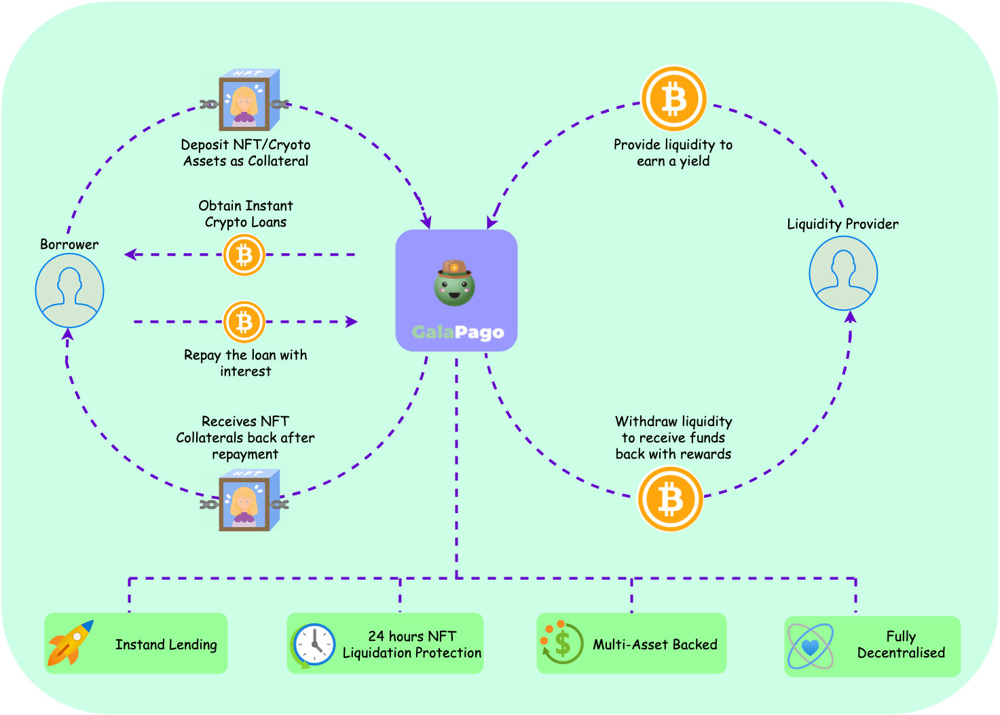

# Introducing Project Galapago

Project Galapago is a fully decentralised, non-custodian NFT and crypto lending protocol. Project Galapago allows user to borrow and lend against both fungible crypto tokens and NFTs instantly using [peer to contract](how-to/borrow-nft-holder.md) mechanism. This provides crypto and NFT users maximum flexibility in getting liquidity in their most preferred way.&#x20;

NFT and crypto investors and holders can obtain liquidity by participate in the protocol as depositors, borrowers or renters.

* **Depositor** enjoys high staking yields by providing liquidity to the lending pool (in peer to contract loans) or lend directly to borrowers to earn interests (in peer to peer loans).&#x20;
* **Borrower** enjoys the fast instant lending capability from the lending pool to increase funds efficiency against their NFT and crypto assets.&#x20;
* [**Renter**](broken-reference) enjoys the benefits of the NFT during the leasing period in the scenario when NFT represents a membership or a digital pass.

### Protocol Overview

<figure><figcaption>
Protocol Overview
</figcaption></figure>
