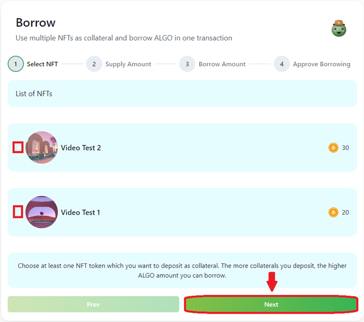

# Borrow (NFT holder)

NFT holders can borrow and repay ALGO anytime. We are in the process of assessing collections as collaterals for Mainnet based on our [whitelisting criteria](../nft-collections-whitelist.md).

Testnet supports any collections as collateral.


User Interface might be different to most recent version of app due to UI change.


[1.1. Connect your wallet](../connect-wallet.md)

[1.2. Mint an NFT for Testnet run](mint-nfts.md) (if you do not have a Testnet NFT handy)

[1.3. Click “Borrow”](borrow-nft-holder.md#1.3.-click-borrow-from-menu-nft-or-click-borrow-algo-from-dashboard)

[1.4. Select an NFT or NFTs as collateral](borrow-nft-holder.md#1.4.-select-an-nft-or-nfts-as-collateral)

[1.5. Supply Token as collateral (Optional)](borrow-nft-holder.md#1.5.-supply-token-as-collateral-optional)

[1.6. Enter the borrowed amount](borrow-nft-holder.md#1.6.-enter-the-borrowed-amount)

[1.7. Approve the transactions](borrow-nft-holder.md#1.7.-approve-the-transactions)

[1.8. Finish](borrow-nft-holder.md#1.8.-finish)

### 1.3. Click “Borrow” from Menu “NFT” or click “Borrow ALGO” from dashboard

.png>)

### 1.4. Select an NFT or NFTs as collateral

Select the NFT or NFTs to be taken as collateral for the loans, and hit “Next” button.

### 1.5. Supply Token as collateral (Optional)

Galapago protocol is also supporting Borrow (loan) with token as collateral. User can effectively take their entire wallet portfolio (FTs and NFTs) to start borrowing with us.

Galapago protocol is currently supporting USDC stable coin (Testnet Asset ID: 10458941) as collateral.

&#x20;.png>)

### 1.6. Enter the borrowed amount

Drag the percentage bar to select borrowed amount and click Next.

.png>)

* Total Price: Indicates the sum of current floor price of NFTs and collateralized token price, provided by Algorand blue chip NFT price oracle. Testnet price feed might not be accurate.
* Utilization rate: Indicates the utilization rate of ALGO liquidity pool, which determines the dynamic interest rate for depositing and borrowing. For more information, please refer to our [interest model page](../interest-rate-model.md).
* Available to borrow: Indicates the maximum amount that can be borrowed, Available to borrow amount = floor price \* collateral rate. Check the [collateral rates](../risk-parameters.md) for NFTs and FTs.
* Borrow Rate: The APR rate that represents the interest to be paid during the borrowing period, which is affected by the Utilization rate.

### 1.7. Approve the transactions

Click on Borrow button and follow the prompts to proceed.

.png>)

Approve transactions with your connected wallet.

.png>)

### 1.8. Finish

You can verify your loan items via "My Borrows" in menu item or dashboard.

.png>)
